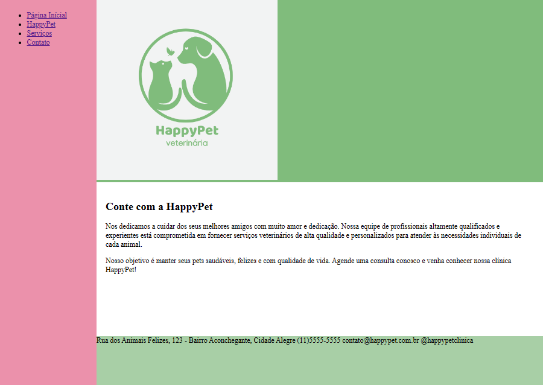

# Página Web - Clínica Veterinária

 

Este desafio tem como objetivo, criar um site "quase" completo, com tudo o que vimos no módulo 2 do curso de HTML da DIO. Os temas que deverão ser abordados são:
- Formulários
- Estruturação e formatação de texto
- Mídias
- Tabelas

OBS: o conteúdo da página foi produzido por mim.

## Tecnológia
HTML e CSS

## Consideração
Aprendi a usar as tags de formulário, tabelas e mídia neste módulo. Apesar de não ter ficado exatamente como eu queria, puder perceber que a estruturação do HTML é fundamental para quando eu for estilizar usando o CSS, e falando nele, notei que tive uma grande dificuldade para me orientar e seguir a descrição de layout proposto pelo professor.  

Apesar de não ter ficado 100% satisfeita, pude notar onde estão minhas falhas e o que preciso melhorar e persistir um pouco mais.